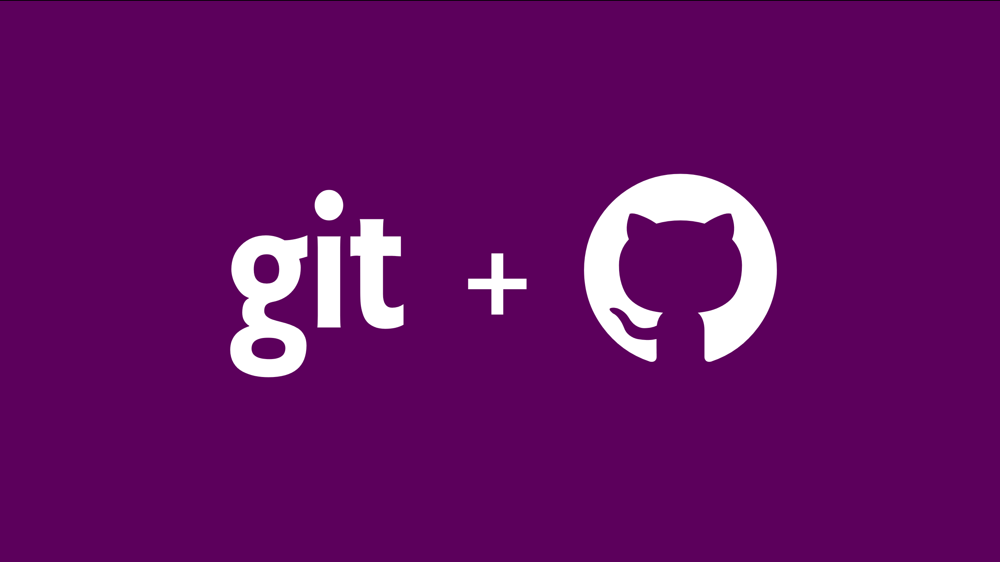

#  ESTUDANDO GIT E GITHUB 

  

## Estados do Git

     [✅] Modificado (modified)
     [✅] Preparado (staged)
     [✅] Consolidado (committed)
    

## Comandos
     [✅] Git init
     [✅] git status
     [✅] git add <arquivo>
     [✅] git commit -m "Comentario"
     [✅] git log 
     [✅] git remote add origin <repo> 
     [✅] git push -u origin  master

## Mais sobre GIT LOG:

Como verificar o histórico de commits, através do git log e algumas de suas opções:
- git log --oneline
- git log -p
- git log --pretty="parametros de formatação"
- git log --graph

---

